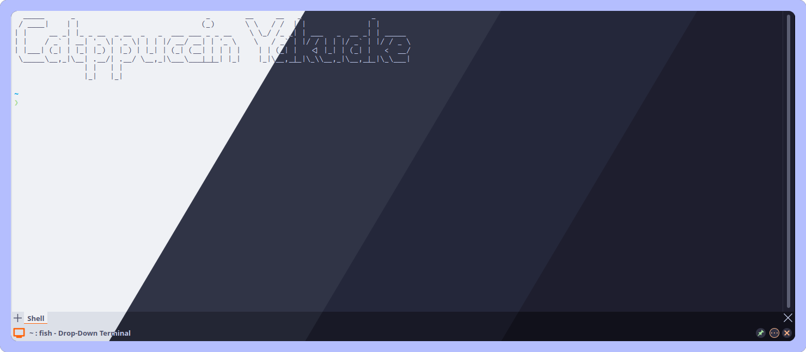
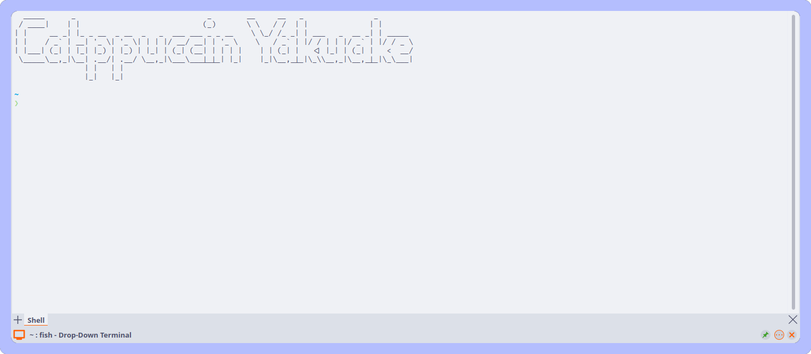
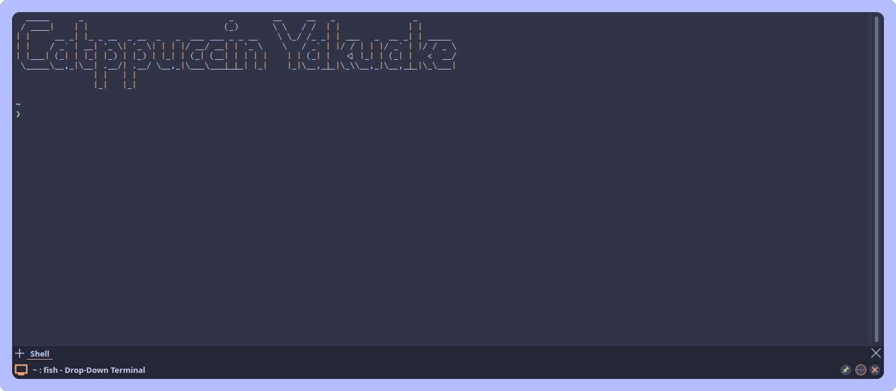
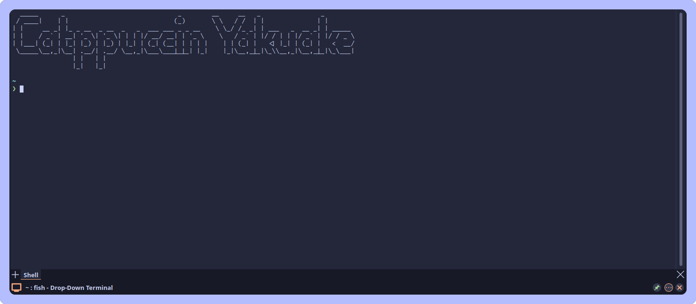
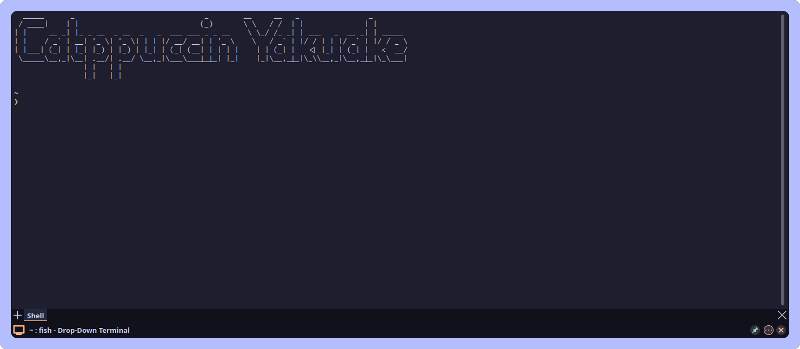

<h3 align="center">
	 
	
	Catppuccin for <a href="https://apps.kde.org/yakuake/">Yakuake</a>
	
</h3>

	
	
	

	

## Previews

🌻 Latte

🪴 Frappé

🌺 Macchiato

🌿 Mocha

## Usage

1. Clone this repository locally
2. Open Yakuake's appearance settings
  1. Click `Menu`
  2. Click `Configure Yakuake...`
  3. Click `Appearance`
3. Select `Install Skin...` and browse to where you cloned Catppuccin
4. Select the `.tar.gz` file for the flavor you'd like
5. Select the new skin from the skin list.
6. Click `OK`

## 💝 Thanks to

- [southqaw](https://github.com/southqaw)

&nbsp;

	

	Copyright &copy; 2021-present <a href="https://github.com/catppuccin" target="_blank">Catppuccin Org</a>

	

